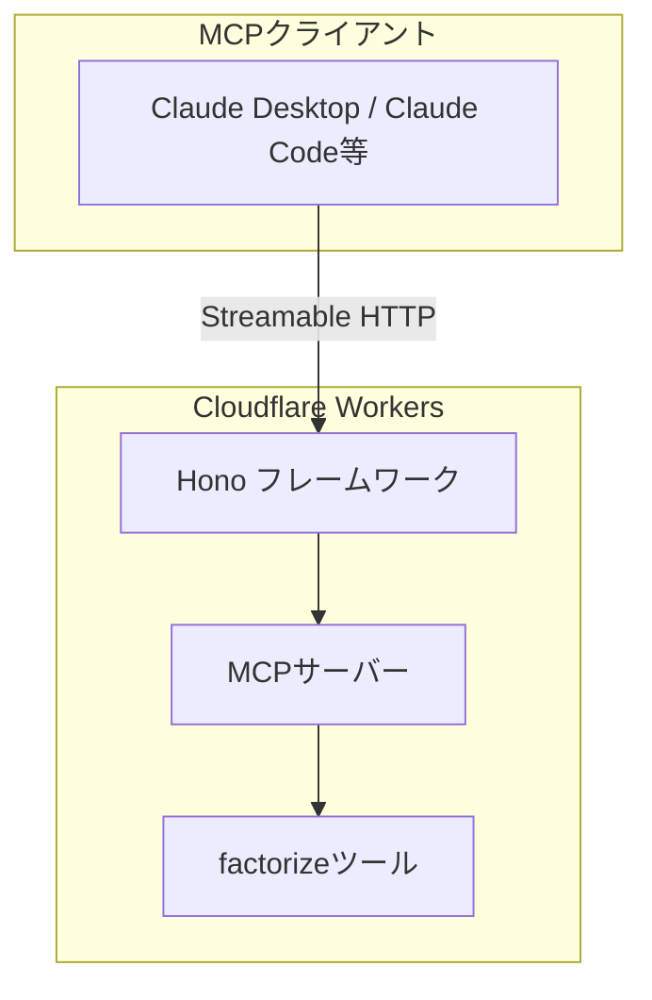
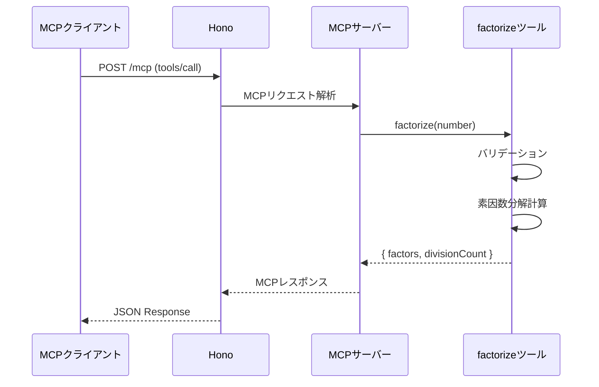
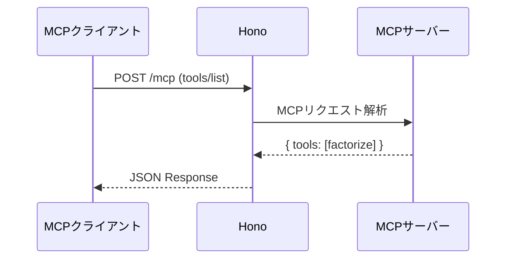

# 機能設計書 (Functional Design Document)

## システム構成図



## 技術スタック

| 分類 | 技術 | 選定理由 |
|------|------|----------|
| 言語 | TypeScript 5.x | 型安全性、MCPライブラリのサポート |
| フレームワーク | Hono | 軽量、Cloudflare Workers最適化、MCPサポート |
| ランタイム | Cloudflare Workers | エッジコンピューティング、無料枠、簡単デプロイ |
| ビルドツール | Wrangler | Cloudflare公式CLI、ローカル開発サポート |
| パッケージマネージャー | npm | 標準的、npx対応 |

## データモデル定義

### FactorizeInput（入力）

```typescript
interface FactorizeInput {
  number: number;  // 素因数分解する正の整数（1以上、15桁以下）
}
```

**制約**:
- `number` は正の整数（1以上）
- 最大値: 999,999,999,999,999（15桁）

### FactorizeOutput（出力）

```typescript
interface FactorizeOutput {
  factors: number[];      // 素因数のリスト（例: [2, 2, 3]）
  divisionCount: number;  // 割り算回数
}
```

### FactorizeError（エラー）

```typescript
interface FactorizeError {
  code: 'INVALID_INPUT' | 'EXCEEDS_LIMIT';
  message: string;  // 日本語エラーメッセージ
}
```

## コンポーネント設計

### MCPサーバー（エントリーポイント）

**責務**:
- HTTPリクエストの受信
- MCPプロトコルの処理
- ツールへのルーティング

**インターフェース**:
```typescript
// Honoアプリケーションとして実装
const app = new Hono();

// MCPエンドポイント
app.post('/mcp', handleMCPRequest);
app.get('/mcp', handleMCPRequest);  // SSE対応
```

### factorizeツール

**責務**:
- 入力値のバリデーション
- 素因数分解の計算
- 割り算回数のカウント
- 結果またはエラーの返却

**インターフェース**:
```typescript
interface FactorizeTool {
  name: 'factorize';
  description: string;
  inputSchema: JSONSchema;
  execute(input: FactorizeInput): FactorizeOutput | FactorizeError;
}
```

**依存関係**:
- なし（Pure Function）

## アルゴリズム設計

### 素因数分解アルゴリズム

**目的**: 正の整数を素因数に分解する

**計算ロジック**:

#### ステップ1: 入力バリデーション
- 入力が正の整数（1以上）かチェック
- 入力が上限（15桁）以下かチェック

#### ステップ2: 素因数分解
- 試行割り算法を使用
- 2から√nまでの数で順に割り切れるかチェック
- 割り切れた数を素因数リストに追加
- 商が1になるまで繰り返し

**実装例**:
```typescript
function factorize(n: number): number[] {
  if (n === 1) return [1];

  const factors: number[] = [];
  let remaining = n;

  // 2で割り切れる間は2を追加
  while (remaining % 2 === 0) {
    factors.push(2);
    remaining = remaining / 2;
  }

  // 3以上の奇数で試行
  let divisor = 3;
  while (divisor * divisor <= remaining) {
    while (remaining % divisor === 0) {
      factors.push(divisor);
      remaining = remaining / divisor;
    }
    divisor += 2;
  }

  // 残りが1より大きければ素数
  if (remaining > 1) {
    factors.push(remaining);
  }

  return factors;
}
```

#### ステップ3: 割り算回数のカウント
- 素因数分解中に行った割り算の回数をカウント
- 結果と共に返却

### パフォーマンス特性

| 入力サイズ | 最悪計算量 | 典型的な実行時間 |
|-----------|-----------|----------------|
| 6桁以下 | O(√n) | < 1ms |
| 7-8桁 | O(√n) | 1-10ms |
| 11-15桁 | O(√n) | 100ms-1s |

## ユースケース図

### ユースケース1: 素因数分解の実行



**フロー説明**:
1. MCPクライアントが `/mcp` エンドポイントにリクエストを送信
2. Honoがリクエストを受信し、MCPサーバーに渡す
3. MCPサーバーが `tools/call` を解析し、factorizeツールを呼び出す
4. factorizeツールが入力をバリデーション
5. バリデーション成功時、素因数分解を実行
6. 結果（素因数リストと割り算回数）を返却
7. MCPプロトコルに準拠したレスポンスとして返却

### ユースケース2: ツール一覧の取得



**フロー説明**:
1. MCPクライアントが `tools/list` リクエストを送信
2. MCPサーバーが利用可能なツール一覧を返却
3. factorizeツールの名前、説明、入力スキーマを含む

## API設計

### MCPエンドポイント

```
POST /mcp
GET /mcp (SSE)
```

### tools/list レスポンス

```json
{
  "tools": [
    {
      "name": "factorize",
      "description": "正の整数を素因数分解します。素因数のリストと割り算回数を返します。",
      "inputSchema": {
        "type": "object",
        "properties": {
          "number": {
            "type": "number",
            "description": "素因数分解する正の整数（1以上、15桁以下）"
          }
        },
        "required": ["number"]
      }
    }
  ]
}
```

### tools/call リクエスト

```json
{
  "method": "tools/call",
  "params": {
    "name": "factorize",
    "arguments": {
      "number": 12
    }
  }
}
```

### tools/call レスポンス（成功時）

```json
{
  "content": [
    {
      "type": "text",
      "text": "12の素因数分解結果:\n素因数: [2, 2, 3]\n割り算回数: 3回"
    }
  ]
}
```

### tools/call レスポンス（エラー時）

```json
{
  "content": [
    {
      "type": "text",
      "text": "エラー: 正の整数を入力してください"
    }
  ],
  "isError": true
}
```

## エラーハンドリング

### エラーの分類

| エラー種別 | 条件 | ユーザーへの表示 |
|-----------|------|-----------------|
| INVALID_INPUT | 入力が正の整数でない（負数、0、小数、文字列） | 「正の整数を入力してください」 |
| EXCEEDS_LIMIT | 入力が15桁を超える | 「入力値が上限（15桁）を超えています」 |

### バリデーション実装（zod）

```typescript
import { z } from "zod";

const MAX_INPUT_VALUE = 9999999999;

const factorizeInputSchema = z.object({
  number: z
    .number({ message: "正の整数を入力してください" })
    .int({ message: "正の整数を入力してください" })
    .min(1, { message: "正の整数を入力してください" })
    .max(MAX_INPUT_VALUE, { message: "入力値が上限（15桁）を超えています" }),
});
```

zodスキーマをMCPサーバーの`registerTool`に渡すことで、自動的にバリデーションが実行される。

## セキュリティ考慮事項

- **入力値の検証**: すべての入力値をバリデーションし、不正な入力を拒否
- **計算量の制限**: 15桁制限によりDoS攻撃を防止
- **認証なし**: サンプルアプリケーションのため意図的に省略（本番利用時は認証追加を推奨）

## パフォーマンス最適化

- **シンプルな実装**: 複雑な最適化よりも可読性を優先
- **計算量上限**: 15桁制限により最悪ケースでも100ms以内
- **ステートレス設計**: Cloudflare Workersのスケーラビリティを活かす

## テスト戦略

### ユニットテスト（実装済み）

**フレームワーク**: Vitest

**テストファイル**: `tests/factorize.test.ts`

**テストケース**:
- 正常系
  - 合成数の分解: 12 → [2, 2, 3]
  - 素数: 7 → [7]
  - 1の処理: 1 → [1]
  - 2の累乗: 64 → [2, 2, 2, 2, 2, 2]
  - 大きな合成数: 360 → [2, 2, 2, 3, 3, 5]
  - 大きな素数: 104729 → [104729]
  - 15桁の数値
- 境界値
  - 最小値1
  - 最小の素数2
  - 最小の合成数4
- 結果の検証
  - 素因数の積が元の数と等しい
  - 結果が昇順にソートされている

**実行方法**:
```bash
npm test
```

### 統合テスト対象

- MCPエンドポイント
  - tools/list レスポンス
  - tools/call レスポンス（成功・エラー）

### 手動テスト

- MCPクライアント（Claude Desktop等）からの接続確認
- ローカル環境での動作確認
- Cloudflare Workersへのデプロイ後の動作確認
